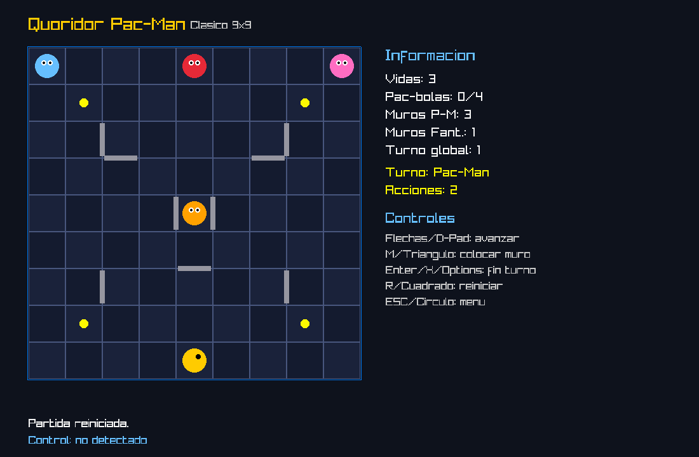

# Quoridor Pac-Man - Trabajo Practico LP1

Implementacion en C usando raylib de una variante jugable de **Quoridor Pac-Man**.

El proyecto incluye configuracion de partida, mapas predefinidos, editor de mapas, modo **IA vs Player**, modo **Player vs Player**, muros temporales, fantasmas con dificultad configurable, soporte para teclado, soporte para gamepad y sonidos opcionales.

---

## Captura

Si agregas una imagen del juego en la carpeta `assets/readme/`, podes mostrarla asi:

```md

```

Ejemplo recomendado de estructura:

```text
assets/
└─ readme/
   └─ screenshot.png
```

---

## Caracteristicas principales

| Caracteristica                         | Estado       |
| -------------------------------------- | ------------ |
| Juego en C con raylib                  | Implementado |
| Tablero dinamico segun mapa            | Implementado |
| 3 mapas predefinidos                   | Implementado |
| Editor de mapas                        | Implementado |
| Guardado y carga de mapas              | Implementado |
| Modo IA vs Player                      | Implementado |
| Modo Player vs Player                  | Implementado |
| Dificultad por fantasma                | Implementado |
| Fantasmas habilitables/deshabilitables | Implementado |
| Muros permanentes                      | Implementado |
| Muros temporales con vida              | Implementado |
| Sonido opcional                        | Implementado |
| Soporte para gamepad                   | Implementado |

---

## Estructura del proyecto

```text
C/
├─ assets/
│  ├─ music/
│  │  └─ background.wav
│  ├─ sounds/
│  │  ├─ eat.wav
│  │  └─ death.wav
│  └─ readme/
│     └─ screenshot.png
├─ maps/
│  ├─ mapa_clasico_9x9.map
│  ├─ mapa_pasillos_7x11.map
│  ├─ mapa_lab_11x9.map
│  └─ custom_map.txt
├─ src/
│  └─ TrabajoPractico1/
│     └─ main1.c
└─ README.md
```

---

## Dependencias

En Ubuntu, Linux Mint o Debian:

```bash
sudo apt update
sudo apt install -y build-essential git make cmake pkg-config
sudo apt install -y libasound2-dev libx11-dev libxrandr-dev libxi-dev libgl1-mesa-dev libglu1-mesa-dev libxcursor-dev libxinerama-dev libwayland-dev libxkbcommon-dev
```

---

## Instalacion de raylib

Si raylib no esta instalada, puede instalarse desde el codigo fuente:

```bash
git clone --depth 1 https://github.com/raysan5/raylib.git
cd raylib/src
make PLATFORM=PLATFORM_DESKTOP
sudo make install
sudo ldconfig
```

Si raylib ya esta instalada, este paso se puede omitir.

---

## Compilacion

Desde la raiz del proyecto, es decir, desde la carpeta `C/`:

```bash
gcc src/TrabajoPractico1/main1.c -o quoridor_pacman -lraylib -lGL -lm -lpthread -ldl -lrt -lX11
```

---

## Ejecucion

```bash
./quoridor_pacman
```

Tambien se puede compilar y ejecutar en un solo comando:

```bash
gcc src/TrabajoPractico1/main1.c -o quoridor_pacman -lraylib -lGL -lm -lpthread -ldl -lrt -lX11 && ./quoridor_pacman
```

Es importante ejecutar el programa desde la raiz del proyecto para que encuentre correctamente las carpetas `maps/` y `assets/`.

---

## Archivos de sonido

El programa tiene soporte opcional para sonido.

Rutas usadas:

```text
assets/music/background.wav
assets/sounds/eat.wav
assets/sounds/death.wav
```

Si estos archivos existen, el juego reproduce musica de fondo y efectos de sonido.

Si no existen, el juego funciona normalmente sin sonido.

---

## Modos de juego

| Modo             | Descripcion                                                    |
| ---------------- | -------------------------------------------------------------- |
| IA vs Player     | Pac-Man es controlado por un jugador y los fantasmas por la IA |
| Player vs Player | Un jugador controla a Pac-Man y otro controla a los fantasmas  |

---

## Reglas principales

Pac-Man tiene **3 vidas**.

Pac-Man gana si come las **4 pac-bolas**.

Los fantasmas ganan si atrapan a Pac-Man **3 veces**.

Pac-Man tiene **2 acciones por turno**. Cada accion puede ser moverse una casilla o colocar un muro temporal.

Si Pac-Man come una pac-bola, recibe **1 accion extra** durante ese turno.

Cada fantasma puede moverse una casilla o colocar un muro temporal.

Si un fantasma ve a Pac-Man en linea recta sin muros en el medio, entra en **modo frenetico** y puede moverse 2 casillas.

Los muros temporales duran una cantidad configurable de turnos y luego vuelven a la mano del equipo que los coloco.

---

## Dificultad de los fantasmas

Cada fantasma tiene una dificultad independiente.

| Dificultad | Comportamiento                                   |
| ---------- | ------------------------------------------------ |
| 1          | Movimiento mas aleatorio                         |
| 2          | Persigue a Pac-Man reduciendo distancia          |
| 3          | Persigue a Pac-Man y puede usar muros temporales |

La dificultad solo afecta al modo **IA vs Player**.

En modo **Player vs Player**, los fantasmas son controlados por un jugador humano.

---

## Controles del menu

| Accion          | Teclado                   | Gamepad                 |
| --------------- | ------------------------- | ----------------------- |
| Elegir opcion   | Flechas arriba/abajo      | D-Pad arriba/abajo      |
| Cambiar valor   | Flechas izquierda/derecha | D-Pad izquierda/derecha |
| Iniciar partida | Enter                     | X / Cross / Options     |
| Abrir editor    | E                         | R1                      |
| Volver o salir  | ESC                       | Circle / Select         |

---

## Controles del juego

| Accion            | Teclado | Gamepad             |
| ----------------- | ------- | ------------------- |
| Mover ficha       | Flechas | D-Pad               |
| Activar modo muro | M       | Triangle            |
| Terminar turno    | Enter   | X / Cross / Options |
| Reiniciar partida | R       | Square              |
| Volver al menu    | ESC     | Circle              |

---

## Controles del editor de mapas

| Accion                | Teclado     | Gamepad    |
| --------------------- | ----------- | ---------- |
| Mover cursor          | Flechas     | D-Pad      |
| Cambiar filas         | + / -       | Teclado    |
| Cambiar columnas      | , / .       | Teclado    |
| Colocar Pac-Man       | P           | Teclado    |
| Colocar fantasmas     | 1, 2, 3, 4  | Teclado    |
| Colocar pac-bolas     | Q, W, E, R  | Teclado    |
| Muro hacia la derecha | H           | Teclado    |
| Muro hacia abajo      | V           | Teclado    |
| Guardar mapa          | S           | L1         |
| Volver al menu        | Enter / ESC | X / Circle |

El mapa creado desde el editor se guarda en:

```text
maps/custom_map.txt
```

Luego puede elegirse desde la pantalla de configuracion como `Mapa del editor`.

---

## Formato de los mapas

Los mapas son archivos de texto.

Ejemplo:

```text
NAME Clasico 9x9
SIZE 9 9
PAC 8 4
GHOST 0 0 4
GHOST 1 0 0
GHOST 2 0 8
GHOST 3 4 4
PELLET 0 1 1
PELLET 1 1 7
PELLET 2 7 1
PELLET 3 7 7
WALL 2 1 2 2
END
```

| Clave  | Significado                        |
| ------ | ---------------------------------- |
| NAME   | Nombre del mapa                    |
| SIZE   | Cantidad de filas y columnas       |
| PAC    | Posicion inicial de Pac-Man        |
| GHOST  | Posicion inicial de cada fantasma  |
| PELLET | Posicion de cada pac-bola          |
| WALL   | Muro permanente entre dos casillas |
| END    | Fin del archivo                    |

---

## Reinicio y fin de partida

Durante la partida se puede presionar `R` o `Square` para reiniciar.

Al terminar la partida, se muestra el ganador y el nivel alcanzado por Pac-Man.

| Pac-bolas comidas | Nivel                |
| ----------------- | -------------------- |
| 1                 | Pac-Man novato       |
| 2                 | Pac-Man prometedor   |
| 3                 | Pac-Man de categoria |
| 4                 | Pac-Man de elite     |

---

## Notas de entrega

El proyecto usa un solo archivo principal, `main1.c`, para facilitar la compilacion en la computadora del docente.

Los archivos de sonido son opcionales.

Los mapas predefinidos se encuentran en la carpeta `maps/`.

El programa debe ejecutarse desde la raiz del proyecto para que las rutas relativas funcionen correctamente.

